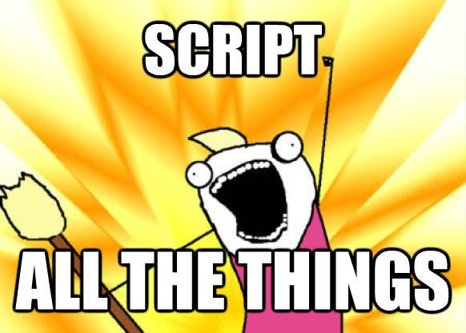

# What Every Software Engineer Should Know (at Codelitt Incubator) 

We have a lot of different specialties at our company. Backend, frontend, mobile, machine learning/AI, etc across many different languages and frameworks. However, regardless of specialty, there are some common skills, methodologies, and theories that every software engineer at our company should know. Many of these do come with what we feel are fair assumptions (e.g. if you know how to fix `rebase` and `merge` conflicts in `git`, we feel it's safe to assume you know the basics of a `git` workflow). 

Every engineer on our team has contributed to this doc and we welcome outside contributions.  

## Tools and skills

* [Unix Basics and Command Line Tools](https://github.com/jlevy/the-art-of-command-line)

* Proficiency in at least **ONE **CLI text editor (nano, vim, etc). Absolutely necessary to manage, debug, troubleshoot (and more) remote servers. We're partial to vim, but pick your poison.

* Version control, specifically the ins and outs of `git`

    * `git` workflow

    * [Tig command line tool](https://github.com/jonas/tig)

    * Advanced checkouts (to specific commits, HEAD, etc)

    * Cherry picking in `git`

    * How to fix `merge` conflicts, how to fix `rebase` conflicts

    * [`merge` vs `rebase`](https://www.atlassian.com/git/tutorials/merging-vs-rebasing)

* How to read code and identify good/bad code

* How to read documentation and debug

    * Small note on this: Google is not bad. Google is your friend. HOWEVER, and this is a big "however," Google to *understand* the *core reason* your code is failing. Do NOT Google just to copy and paste someone else’s fix. If you work with Ruby, understand what causes a `NoMethod Error` on a nil object for example. With Javascript, understand what causes the object to be `undefined`. With Python, understand a `TypeError: 'str' object` is probably because strings are immutable data types. Et cetera. Understanding errors and why they commonly occur, will make you a better programmer, better at debugging, and give you more insight into the language/framework.

    * Same goes for documentation: Documentation almost always > tutorials. Tutorials are great to get the basics of something up and running, but they often skim over the why something works the way it works. 

* How to contribute to open source 

* How to use and organise tasks on Trello (or similar Kanban system if we end up changing)

* Semantic Versioning ([http://semver.org/](http://semver.org/))

* Data structures and algorithms

* Good understanding of matrices and matrix manipulation in whatever language you are writing in. Particularly if interested in ML & AI you really want to understand how to manipulate your data. 

* Basics of Docker

    * Create an image

    * Create a container

    * Connect containers

    * [Understand how we use them across environments](./environments.md)

## Methodologies

* [TDD](https://en.wikipedia.org/wiki/Test-driven_development)

* [BDD](https://pt.wikipedia.org/wiki/Behavior_Driven_Development)

* [Continuous Integration](https://en.wikipedia.org/wiki/Continuous_integration)

* [Continuous Delivery](https://en.wikipedia.org/wiki/Continuous_delivery)

## Principles and theories 

* Understand basic OO Analysis and Design

* Understand the [SOLID](https://en.wikipedia.org/wiki/SOLID_(object-oriented_design))[ principles](https://en.wikipedia.org/wiki/SOLID_(object-oriented_design))

* Understand [Design Patterns](https://en.wikipedia.org/wiki/Software_design_pattern)

* Understand [Basic Architectural Patterns](https://en.wikipedia.org/wiki/Architectural_pattern)

* Understand the [KISS](http://en.wikipedia.org/wiki/KISS_principle) principle

* Understand the [DRY principle](https://en.wikipedia.org/wiki/Don%27t_repeat_yourself) *and practice it every day*

    * Ask yourself, will this action be done more than once? This does not just apply to a program, this also applies in the workplace! In the ML, AI and Robotics lab, a recent one I saw was needing to list out all of the images that had been trained by the network, create a folder for those images, and put the images in said folder. That would be a HUGE pain to do manually.

* [Pareto Principle](https://en.wikipedia.org/wiki/Pareto_principle) aka the 80/20 Rule 

* [Orthogonality](https://en.wikipedia.org/wiki/Orthogonality_(programming)) principles 

